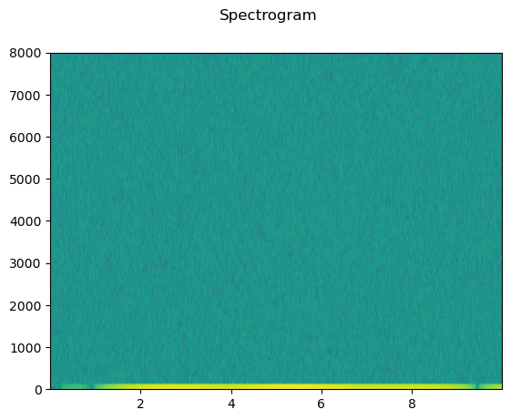
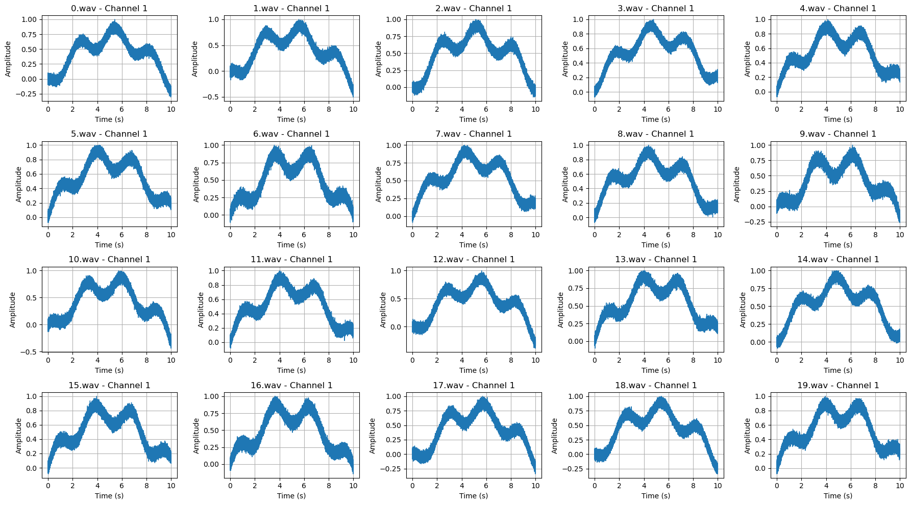
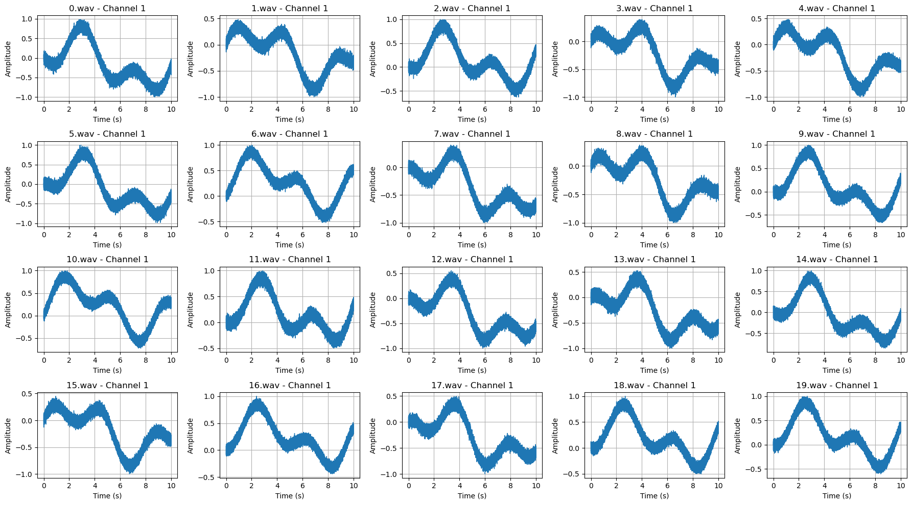
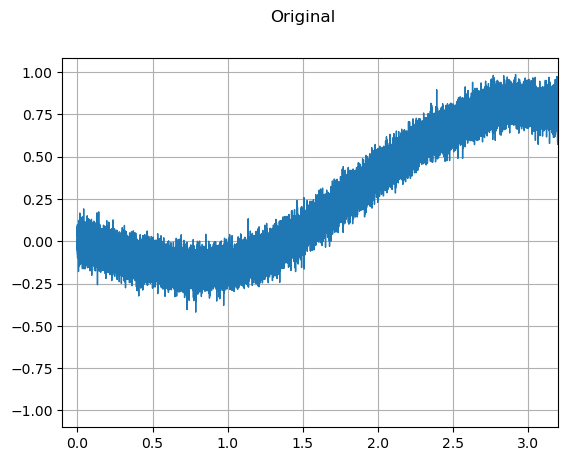
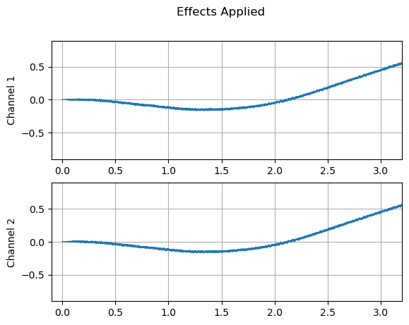
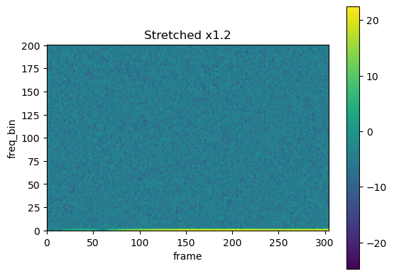
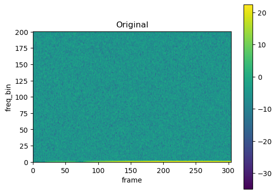
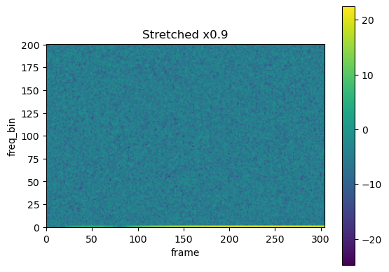
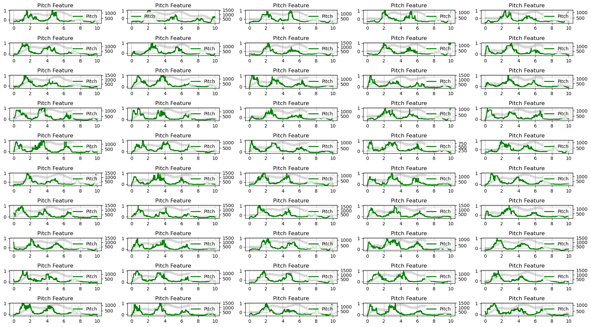

## Package Dependencies
```
import os
import math, random
import wave
import numpy as np
import matplotlib
import matplotlib.pyplot as plt
import pandas as pd
from torch.utils.data import Dataset, random_split, DataLoader
from scipy.io.wavfile import read as read_wav
from natsort import natsorted
import librosa
import torch
import torch.nn as nn
from torch.nn import init
from torch.utils.data import Dataset, DataLoader, random_split
from torch.optim.lr_scheduler import OneCycleLR
import torchaudio
import torchaudio.functional as F
import torchaudio.transforms as T
from sklearn.svm import SVC
from sklearn.preprocessing import StandardScaler
from sklearn.neighbors import KNeighborsClassifier
from sklearn.ensemble import RandomForestClassifier
from sklearn.metrics import accuracy_score, classification_report
from torchaudio import transforms
from IPython.display import Audio
```
## Scan the audio file directory and check file integrity
```
path = '/class0'
file_list = os.listdir(path)
c0_list = []
for f in file_list:
    if os.path.splitext(f)[1] == '.wav':
        c0_list.append(f)
c0_list = natsorted(c0_list)

path = '/class1'
file_list = os.listdir(path)
c1_list = []
for f in file_list:
    if os.path.splitext(f)[1] == '.wav':
        c1_list.append(f)
c1_list = natsorted(c1_list)

print(len(c0_list), len(c1_list))
```
50 20
# Undestanding Data
## Look a single data
```
metadata = torchaudio.info('class1/0.wav')
print(metadata)
```
AudioMetaData(sample_rate=16000, num_frames=160000, num_channels=1, bits_per_sample=64, encoding=PCM_F)
## Visualize this single data
```
waveform, sample_rate = torchaudio.load('class0/0.wav')

print_stats(waveform, sample_rate=sample_rate)
plot_waveform(waveform, sample_rate)
plot_specgram(waveform, sample_rate)
```
Sample Rate: 16000
Shape: (1, 160000)
Dtype: torch.float32
 - Max:      1.000
 - Min:     -0.307
 - Mean:     0.419
 - Std Dev:  0.275

tensor([[-0.0329, -0.0375, -0.0166,  ..., -0.2747, -0.2009, -0.2282]])




## Visualize all raw data
### Preparation
### Viusal Class0
```
def print_stats(waveform, sample_rate=None, src=None):
  if src:
    print("-" * 10)
    print("Source:", src)
    print("-" * 10)
  if sample_rate:
    print("Sample Rate:", sample_rate)
  print("Shape:", tuple(waveform.shape))
  print("Dtype:", waveform.dtype)
  print(f" - Max:     {waveform.max().item():6.3f}")
  print(f" - Min:     {waveform.min().item():6.3f}")
  print(f" - Mean:    {waveform.mean().item():6.3f}")
  print(f" - Std Dev: {waveform.std().item():6.3f}")
  print()
  print(waveform)
  print()
    
def plot_specgram(waveform, sample_rate, title="Spectrogram", xlim=None):
  waveform = waveform.numpy()

  num_channels, num_frames = waveform.shape
  time_axis = torch.arange(0, num_frames) / sample_rate

  figure, axes = plt.subplots(num_channels, 1)
  if num_channels == 1:
    axes = [axes]
  for c in range(num_channels):
    axes[c].specgram(waveform[c], Fs=sample_rate)
    if num_channels > 1:
      axes[c].set_ylabel(f'Channel {c+1}')
    if xlim:
      axes[c].set_xlim(xlim)
  figure.suptitle(title)
  plt.show(block=False)

def plot_waveforms(waveforms, sample_rate, titles=None, xlim=None, ylim=None):
    num_waveforms, num_channels, num_samples = waveforms.shape
    time_axis = torch.arange(0, num_samples) / sample_rate

    num_rows = min(num_waveforms, 4)
    num_cols = min((num_waveforms + num_rows - 1) // num_rows, 5)

    fig, axes = plt.subplots(num_rows, num_cols, figsize=(18, 10))
    axes = axes.ravel() 

    for i in range(num_rows * num_cols):
        if i < num_waveforms:
            for c in range(num_channels):
                ax = axes[i * num_channels + c]  
                ax.plot(time_axis.numpy(), waveforms[i, c].numpy(), linewidth=1)
                ax.grid(True)
                if titles:
                    ax.set_title(titles[i] + f" - Channel {c+1}")
                else:
                    ax.set_title(f"Waveform {i+1} - Channel {c+1}")
                ax.set_xlabel('Time (s)')
                ax.set_ylabel('Amplitude')

                if xlim:
                    ax.set_xlim(xlim)
                if ylim:
                    ax.set_ylim(ylim)

    plt.tight_layout()
    plt.show()

all_waveforms = []

for c0 in sorted(c0_list):
    waveform, sample_rate = torchaudio.load('class0/' + str(c0))
    all_waveforms.append(waveform)
    
all_waveforms_tensor = torch.stack(all_waveforms)
plot_waveforms(all_waveforms_tensor, sample_rate, titles=c0_list, xlim=None, ylim=None)
```

### Viusal Class1
```
all_waveforms = []
    
for c1 in sorted(c1_list):
    waveform, sample_rate = torchaudio.load('class1/' + str(c1))
    all_waveforms.append(waveform)
    
all_waveforms_tensor = torch.stack(all_waveforms)
plot_waveforms(all_waveforms_tensor, sample_rate, titles=c1_list, xlim=None, ylim=None)
```

## Determine to normalize or not
## Check sample rate to see if we need to Standardize sampling rate
```
for c0 in sorted(c0_list):
    waveform, sample_rate = torchaudio.load('class0/' + str(c1))
    print(c0, sample_rate)

for c1 in sorted(c1_list):
    waveform, sample_rate = torchaudio.load('class1/' + str(c1))
    print(c1, sample_rate)
```
## Determine Data Augmentation or not
### apply effects to data to see results
```
waveform1, sample_rate1 = torchaudio.load('class1/0.wav')

effects = [
  ["lowpass", "-1", "300"], 
  ["speed", "0.8"],  
  ["rate", f"{sample_rate1}"],
  ["reverb", "-w"],  
]

waveform2, sample_rate2 = torchaudio.sox_effects.apply_effects_tensor(
    waveform1, sample_rate1, effects)

plot_waveform(waveform1, sample_rate1, title="Original", xlim=(-.1, 3.2))
plot_waveform(waveform2, sample_rate2, title="Effects Applied", xlim=(-.1, 3.2))
print_stats(waveform1, sample_rate=sample_rate1, src="Original")
print_stats(waveform2, sample_rate=sample_rate2, src="Effects Applied")
```




----------
Source: Original
----------
Sample Rate: 16000
Shape: (1, 160000)
Dtype: torch.float32
 - Max:      0.985
 - Min:     -1.000
 - Mean:    -0.150
 - Std Dev:  0.482

tensor([[ 0.0749, -0.0468,  0.0461,  ..., -0.2309, -0.2032, -0.2890]])

----------
Source: Effects Applied
----------
Sample Rate: 16000
Shape: (2, 200000)
Dtype: torch.float32
 - Max:      0.815
 - Min:     -0.824
 - Mean:    -0.139
 - Std Dev:  0.476

tensor([[ 0.0000,  0.0000,  0.0000,  ..., -0.4799, -0.4832, -0.4840],
        [ 0.0000,  0.0000,  0.0000,  ..., -0.4758, -0.4765, -0.4737]])

## Determine Feature Augmentation or not

```
SAMPLE_WAV_SPEECH_PATH = 'class0/0.wav'

def _get_sample(path, resample=None):
  effects = [
    ["remix", "1"]
  ]
  if resample:
    effects.extend([
      ["lowpass", f"{resample // 2}"],
      ["rate", f'{resample}'],
    ])
  return torchaudio.sox_effects.apply_effects_file(path, effects=effects)

def get_speech_sample(*, resample=None):
  return _get_sample(SAMPLE_WAV_SPEECH_PATH, resample=resample)

def get_spectrogram(
    n_fft = 400,
    win_len = None,
    hop_len = None,
    power = 2.0,
):
  waveform, _ = get_speech_sample()
  spectrogram = T.Spectrogram(
      n_fft=n_fft,
      win_length=win_len,
      hop_length=hop_len,
      center=True,
      pad_mode="reflect",
      power=power,
  )
  return spectrogram(waveform)

spec = get_spectrogram(power=None)
strech = T.TimeStretch()

rate = 1.2
spec_ = strech(spec, rate)
plot_spectrogram(spec_[0].abs(), title=f"Stretched x{rate}", aspect='equal', xmax=304)

plot_spectrogram(spec[0].abs(), title="Original", aspect='equal', xmax=304)

rate = 0.9
spec_ = strech(spec, rate)
plot_spectrogram(spec_[0].abs(), title=f"Stretched x{rate}", aspect='equal', xmax=304)
```




## Determine pitch or not
```
def plot_pitch(waveform, sample_rate, pitch, ax):
    ax.set_title("Pitch Feature")
    ax.grid(True)

    end_time = waveform.shape[1] / sample_rate
    time_axis = torch.linspace(0, end_time, waveform.shape[1])
    ax.plot(time_axis, waveform[0], linewidth=1, color='gray', alpha=0.3)

    ax2 = ax.twinx()
    time_axis = torch.linspace(0, end_time, pitch.shape[1])
    ax2.plot(
        time_axis, pitch[0], linewidth=2, label='Pitch', color='green')

    ax2.legend(loc=0)

path = '/class0'

file_list = os.listdir(path)
c0_list = [os.path.join(path, f) for f in file_list if os.path.splitext(f)[1] == '.wav']
c0_list = natsorted(c0_list)

num_files = len(c0_list)
num_rows = (num_files + 4) // 5  # Round up to the nearest multiple of 5
num_cols = 5

fig, axes = plt.subplots(num_rows, num_cols, figsize=(18, 10))

for idx, file_path in enumerate(c0_list):
    row_idx = idx // num_cols
    col_idx = idx % num_cols
    ax = axes[row_idx, col_idx] if num_files > 1 else axes
    waveform, sample_rate = torchaudio.load(file_path)
    pitch = F.detect_pitch_frequency(waveform, sample_rate)
    plot_pitch(waveform, sample_rate, pitch, ax)

for idx in range(len(c0_list), num_rows * num_cols):
    row_idx = idx // num_cols
    col_idx = idx % num_cols
    ax = axes[row_idx, col_idx] if num_files > 1 else axes
    ax.axis('off')

plt.tight_layout()
plt.show()
```

