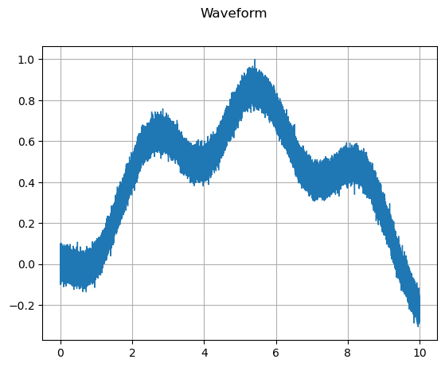

## Package Dependencies
```
import os
import math, random
import wave
import numpy as np
import matplotlib
import matplotlib.pyplot as plt
import pandas as pd
from torch.utils.data import Dataset, random_split, DataLoader
from scipy.io.wavfile import read as read_wav
from natsort import natsorted
import librosa
import torch
import torch.nn as nn
from torch.nn import init
from torch.utils.data import Dataset, DataLoader, random_split
from torch.optim.lr_scheduler import OneCycleLR
import torchaudio
import torchaudio.functional as F
import torchaudio.transforms as T
from sklearn.svm import SVC
from sklearn.preprocessing import StandardScaler
from sklearn.neighbors import KNeighborsClassifier
from sklearn.ensemble import RandomForestClassifier
from sklearn.metrics import accuracy_score, classification_report
from torchaudio import transforms
from IPython.display import Audio
```
## Scan the audio file directory and check file integrity
```
path = '/class0'
file_list = os.listdir(path)
c0_list = []
for f in file_list:
    if os.path.splitext(f)[1] == '.wav':
        c0_list.append(f)
c0_list = natsorted(c0_list)

path = '/class1'
file_list = os.listdir(path)
c1_list = []
for f in file_list:
    if os.path.splitext(f)[1] == '.wav':
        c1_list.append(f)
c1_list = natsorted(c1_list)

print(len(c0_list), len(c1_list))
```
50 20
## look a single data
```
metadata = torchaudio.info('class1/0.wav')
print(metadata)
```
AudioMetaData(sample_rate=16000, num_frames=160000, num_channels=1, bits_per_sample=64, encoding=PCM_F)
## Visualize this single data
```
waveform, sample_rate = torchaudio.load('/Users/Qiuqi/Desktop/Exports_ASQ/Voice_DATAFILES/class0/0.wav')

print_stats(waveform, sample_rate=sample_rate)
plot_waveform(waveform, sample_rate)
plot_specgram(waveform, sample_rate)
```
Sample Rate: 16000
Shape: (1, 160000)
Dtype: torch.float32
 - Max:      1.000
 - Min:     -0.307
 - Mean:     0.419
 - Std Dev:  0.275

tensor([[-0.0329, -0.0375, -0.0166,  ..., -0.2747, -0.2009, -0.2282]])




## Visualize raw data
### Preparation
```
def print_stats(waveform, sample_rate=None, src=None):
  if src:
    print("-" * 10)
    print("Source:", src)
    print("-" * 10)
  if sample_rate:
    print("Sample Rate:", sample_rate)
  print("Shape:", tuple(waveform.shape))
  print("Dtype:", waveform.dtype)
  print(f" - Max:     {waveform.max().item():6.3f}")
  print(f" - Min:     {waveform.min().item():6.3f}")
  print(f" - Mean:    {waveform.mean().item():6.3f}")
  print(f" - Std Dev: {waveform.std().item():6.3f}")
  print()
  print(waveform)
  print()

def plot_waveform(waveform, sample_rate, title="Waveform", xlim=None, ylim=None):
  waveform = waveform.numpy()

  num_channels, num_frames = waveform.shape
  time_axis = torch.arange(0, num_frames) / sample_rate

  figure, axes = plt.subplots(num_channels, 1)
  if num_channels == 1:
    axes = [axes]
  for c in range(num_channels):
    axes[c].plot(time_axis, waveform[c], linewidth=1)
    axes[c].grid(True)
    if num_channels > 1:
      axes[c].set_ylabel(f'Channel {c+1}')
    if xlim:
      axes[c].set_xlim(xlim)
    if ylim:
      axes[c].set_ylim(ylim)
  figure.suptitle(title)
  plt.show(block=False)
    
def plot_specgram(waveform, sample_rate, title="Spectrogram", xlim=None):
  waveform = waveform.numpy()

  num_channels, num_frames = waveform.shape
  time_axis = torch.arange(0, num_frames) / sample_rate

  figure, axes = plt.subplots(num_channels, 1)
  if num_channels == 1:
    axes = [axes]
  for c in range(num_channels):
    axes[c].specgram(waveform[c], Fs=sample_rate)
    if num_channels > 1:
      axes[c].set_ylabel(f'Channel {c+1}')
    if xlim:
      axes[c].set_xlim(xlim)
  figure.suptitle(title)
  plt.show(block=False)
```
AudioMetaData(sample_rate=16000, num_frames=160000, num_channels=1, bits_per_sample=64, encoding=PCM_F)


